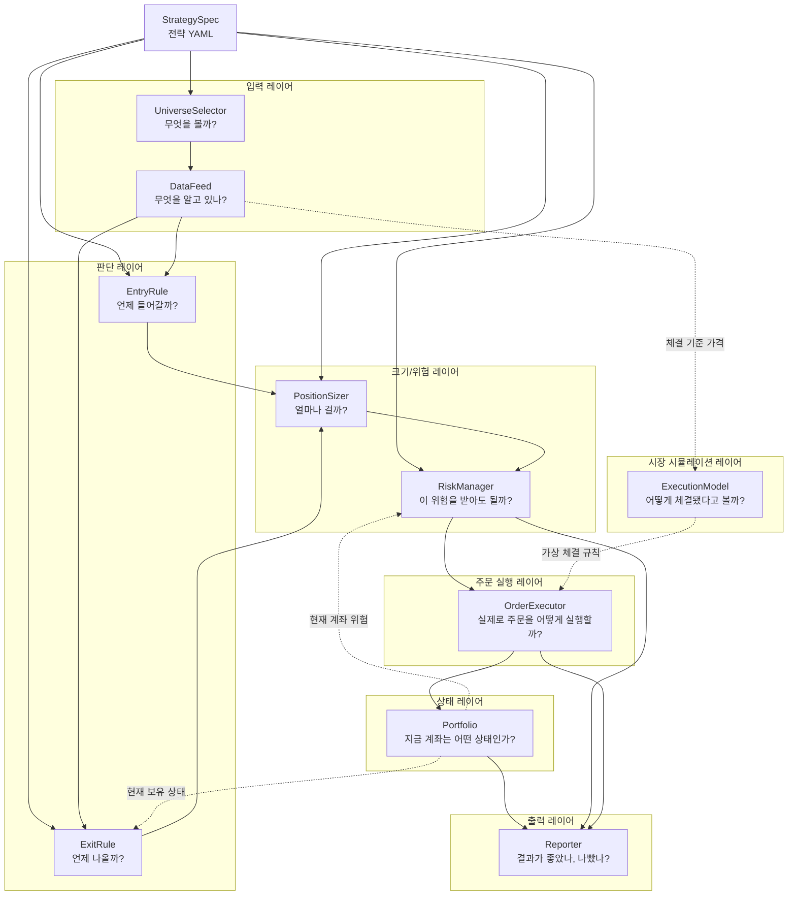

# eolmasa Trading Engine Layers

`eolmasa`는 미국 ETF 자동매매 봇을 1차 목표로 하는 Go 기반 시스템 트레이딩 프로젝트다. 초기 목표는 실거래 주문을 바로 넣는 봇이 아니라, 리서치 결과를 받아 규칙 기반으로 백테스트, 리스크 검증, 페이퍼 트레이딩을 반복할 수 있는 실행 엔진을 만드는 것이다.

이 문서는 첫 설계 기준으로 삼을 레이어와 각 컴포넌트의 책임을 정리한다. 핵심 원칙은 간단하다. 전략을 하나의 큰 덩어리로 만들지 않고, 무엇을 볼지, 언제 들어갈지, 얼마나 걸지, 어떻게 체결됐다고 볼지, 결과가 어땠는지를 서로 다른 책임으로 나눈다.

## 목표

- 미국 ETF 시장을 1차 대상으로 한다.
- 초기에는 가상 시장, 가상 계좌, 가상 체결 환경에서 검증한다.
- 데이터와 전략은 교체 가능해야 한다.
- 전략은 YAML 같은 선언형 데이터로 표현할 수 있어야 한다.
- 전략은 주문을 직접 실행하지 않고 의도나 신호를 만든다.
- 모든 주문은 리스크 검증과 주문 실행 레이어를 거친 뒤 포트폴리오에 반영된다.
- 백테스트와 페이퍼 트레이딩, 실거래는 가능한 한 같은 규칙과 인터페이스를 공유한다.

## 전체 흐름

```text
StrategySpec
  -> UniverseSelector
  -> DataFeed
  -> EntryRule / ExitRule
  -> PositionSizer
  -> RiskManager
  -> OrderExecutor
  -> Portfolio
  -> Reporter
```



각 단계는 앞 단계의 결과를 받아 다음 단계로 넘긴다. 이 흐름을 유지하면 특정 전략 하나를 고치는 일이 계좌 상태, 리포트, 주문 실행 방식까지 흔들지 않는다.

`StrategySpec`은 전략을 Go 코드가 아니라 YAML 같은 선언형 데이터로 표현하는 입구다. 엔진은 이 선언을 검증한 뒤 `UniverseSelector`, `EntryRule`, `ExitRule`, `PositionSizer`, `RiskManager` 같은 레이어 설정으로 나누어 전달한다.

전략 신호와 실행 조건은 같은 YAML 파일에 있을 수 있지만 같은 document 에 섞지 않는다. Kubernetes 리소스처럼 `kind: Strategy` 와 `kind: BacktestRun` 을 `---` 로 나누고, 실행 스펙이 전략 이름을 참조한다. 반복 실험이 늘어나면 `Universe`, `RiskPolicy`, `ExecutionProfile` 같은 별도 kind 로 더 분리할 수 있다.

## 세부 문서

- [다중 타임프레임 설계](timeframes/README.md)
- [전략 YAML 설계](strategy-spec/README.md)
- [실행 스펙 설계](execution-spec/README.md)
- [UniverseSelector](layers/universe-selector/README.md)
- [DataFeed](layers/data-feed/README.md)
- [EntryRule](layers/entry-rule/README.md)
- [ExitRule](layers/exit-rule/README.md)
- [PositionSizer](layers/position-sizer/README.md)
- [RiskManager](layers/risk-manager/README.md)
- [OrderExecutor](layers/order-executor/README.md)
- [ExecutionModel](layers/execution-model/README.md)
- [Portfolio](layers/portfolio/README.md)
- [Reporter](layers/reporter/README.md)

## 레이어별 책임

### UniverseSelector: 무엇을 볼까?

`UniverseSelector`는 전략이 감시할 종목 집합을 결정한다.

미국 ETF에서는 전체 상장 ETF를 그대로 보는 대신, 거래 가능성과 전략 목적에 맞게 후보군을 줄이는 일이 먼저 필요하다.

예를 들면 다음과 같은 조건을 가질 수 있다.

- 주요 자산군, 섹터, 국가, 스타일 ETF를 포함한다.
- 거래대금과 스프레드 기준을 통과한 ETF만 포함한다.
- AUM, 상장 기간, 운용사, 추종 지수 기준을 통과한 ETF만 포함한다.
- 레버리지, 인버스, 초단기 상품은 별도 정책으로 제한한다.
- 사용자가 지정한 관심 ETF 바스켓만 포함한다.

`UniverseSelector`의 출력은 "오늘 이 엔진이 관찰할 종목 목록"이다. 진입 여부를 판단하지는 않는다.

### DataFeed: 무엇을 알고 있나?

`DataFeed`는 엔진에 시장 데이터를 공급한다.

백테스트에서는 과거 데이터를 시간순으로 재생하고, 페이퍼 트레이딩에서는 오늘 또는 최근 데이터를 공급한다. 실거래 단계에서는 브로커 API, 데이터 vendor, 파일, DB, 외부 리서치 결과를 입력으로 받을 수 있다.

초기에 다룰 데이터는 단순하게 시작한다.

- 날짜
- 티커
- 시가, 고가, 저가, 종가
- 거래량
- 거래대금
- 거래 가능 여부
- 정규장, 프리마켓, 애프터마켓 구분

`DataFeed`의 책임은 데이터를 가져오고 정규화하는 것이다. 전략 판단, 주문 생성, 리스크 검증을 직접 하지 않는다.

분 단위 거래와 [다중 타임프레임](timeframes/README.md)을 지원하려면 `DataFeed`는 하나의 구현체로 끝내지 않는다. 데이터 공급 경로를 다음 책임으로 나누는 편이 좋다.

- `SourceConnector`는 브로커 API, 데이터 vendor, 파일, DB 같은 외부 데이터 출처에서 원천 데이터를 가져온다.
- `MarketDataStore`는 가져온 원천 데이터와 정규화된 데이터를 저장한다.
- `HistoricalFeed`는 백테스트에 필요한 과거 데이터를 시간순으로 재생한다.
- `LiveFeed`는 페이퍼 트레이딩이나 실거래에 필요한 현재 데이터를 공급한다.
- `BarBuilder`는 실시간 체결 데이터나 더 짧은 주기 데이터를 1분봉, 3분봉, 5분봉 같은 봉 데이터로 집계한다.

분 단위 매매에서 중요한 점은 "전략이 보는 시간 단위"를 데이터 모델과 전략 실행 정책에 명시하는 것이다.

```text
Timeframe = 1d | 1m | 3m | 5m | tick
```

일봉 전략은 하루에 한 번 `DailyBar`를 받아도 충분하지만, 분봉 전략은 장중에 계속 `IntradayBar` 또는 `Tick` 이벤트를 받아야 한다.

다만 어떤 타임프레임을 상위 판단, 진입 판단, 주문 실행에 사용할지는 `DataFeed`가 아니라 `TimeframePolicy`와 `EvaluationScheduler`가 결정한다.

```text
Raw Source
  -> SourceConnector
  -> MarketDataStore
  -> HistoricalFeed / LiveFeed
  -> BarBuilder
  -> Strategy Rules
```

초기 구현에서는 다음 순서가 안전하다.

1. 일봉 `HistoricalFeed`로 백테스트 루프를 먼저 만든다.
2. 저장소에 1분봉 스키마를 추가한다.
3. 과거 또는 당일 1분봉을 재생하는 `HistoricalFeed`를 만든다.
4. 실시간 체결 데이터를 받아 1분봉을 만드는 `BarBuilder`를 붙인다.
5. 페이퍼 트레이딩에서 장중 1분봉 이벤트를 처리한다.
6. 마지막에 실거래 주문 실행과 연결한다.

분 단위 거래를 전체 종목 대상으로 바로 돌리면 API 호출량과 저장량이 커진다. 그래서 장중 분봉 전략은 보통 `UniverseSelector`가 먼저 후보군을 좁히고, `DataFeed`는 그 후보군에 대해서만 촘촘한 데이터를 가져오도록 설계한다.

### EntryRule: 언제 들어갈까?

`EntryRule`은 신규 진입 조건을 판단한다.

예를 들면 다음과 같은 규칙이 될 수 있다.

- 20일 신고가 돌파 시 진입한다.
- 이동평균선이 특정 조건을 만족하면 진입한다.
- 거래대금 증가와 가격 돌파가 동시에 발생하면 진입한다.
- 사용자가 정의한 스크리닝 결과가 특정 기준을 넘으면 진입한다.

`EntryRule`은 보통 "이 종목에 진입할 수 있다"는 신호나 주문 의도를 만든다. 실제 수량과 최종 주문 가능 여부는 뒤 단계에서 결정한다.

### ExitRule: 언제 나올까?

`ExitRule`은 보유 포지션을 언제 줄이거나 청산할지 판단한다.

청산 규칙은 시스템의 성격을 크게 바꾼다. 같은 진입 규칙을 쓰더라도 청산 규칙에 따라 추세 추종, 단기 반등, 리밸런싱 전략이 전혀 다른 결과를 낼 수 있다.

예를 들면 다음과 같은 규칙이 있다.

- 10일 저가 이탈 시 청산한다.
- 손절선에 닿으면 청산한다.
- 목표 수익률에 도달하면 일부 또는 전부 청산한다.
- 보유 기간이 일정 기간을 넘으면 청산한다.
- 변동성이나 추세 강도가 약해지면 청산한다.

`ExitRule`도 계좌를 직접 바꾸지 않는다. 청산 의도를 만들고, 이후 체결 모델과 포트폴리오가 실제 반영을 담당한다.

### PositionSizer: 얼마나 걸까?

`PositionSizer`는 진입 또는 추가 진입 시 얼마나 살지 결정한다.

시스템 트레이딩에서 포지션 크기는 진입 신호만큼 중요하다. 같은 종목을 같은 날 사더라도, 한 거래에 전체 자산의 1%를 위험에 노출하는지 10%를 노출하는지에 따라 완전히 다른 시스템이 된다.

예를 들면 다음과 같은 방식이 있다.

- 종목당 고정 금액을 매수한다.
- 총자산의 일정 비율을 매수한다.
- 한 거래의 최대 손실 금액을 기준으로 수량을 정한다.
- ATR 같은 변동성 지표를 기준으로 수량을 조정한다.
- 터틀 트레이딩의 `N` 개념처럼 변동성이 큰 종목은 적게, 작은 종목은 많이 산다.

`PositionSizer`의 출력은 주문 후보의 수량 또는 금액이다. 단, 이 결과가 항상 실행된다는 뜻은 아니다. 최종 허용 여부는 `RiskManager`가 판단한다.

### RiskManager: 이 위험을 받아도 될까?

`RiskManager`는 주문 후보가 계좌 전체 관점에서 허용 가능한지 검사한다.

`PositionSizer`가 "얼마나 살까"를 계산한다면, `RiskManager`는 "그렇게 사도 되는가"를 묻는다.

예를 들면 다음과 같은 제한을 둘 수 있다.

- 한 종목의 최대 비중을 제한한다.
- 하루 신규 진입 개수를 제한한다.
- 전체 주식 비중을 제한한다.
- 동일 업종이나 테마에 과도하게 몰리지 않도록 한다.
- 일일 손실 한도에 도달하면 신규 주문을 막는다.
- 최대 낙폭이 기준을 넘으면 포지션을 줄이거나 거래를 멈춘다.

`RiskManager`는 주문을 승인, 거절, 축소할 수 있다. 거절이나 축소가 발생하면 그 이유를 로그와 리포트에 남겨야 한다.

### OrderExecutor: 실제로 주문을 어떻게 실행할까?

`OrderExecutor`는 리스크 검증을 통과한 주문을 실행하고 체결 결과를 만든다.

이 레이어가 실제 매수와 매도를 담당한다. `EntryRule`과 `ExitRule`은 진입과 청산이 필요하다는 의도를 만들 뿐이고, `OrderExecutor`가 그 의도를 주문으로 실행한다.

모드에 따라 구현체가 달라질 수 있다.

- `BacktestExecutor`는 과거 데이터와 체결 가정을 이용해 가상 체결을 만든다.
- `PaperExecutor`는 실제 주문을 넣지 않고 가상 계좌에만 체결을 반영한다.
- `LiveExecutor`는 브로커 API를 통해 실제 매수, 매도 주문을 넣는다.

`OrderExecutor`의 출력은 체결 결과다. 체결 결과에는 체결 여부, 체결 수량, 체결 가격, 수수료, 세금, 실패 이유가 포함되어야 한다.

실거래 단계에서는 이 레이어가 가장 위험한 경계가 된다. 그래서 `LiveExecutor`는 주문 전 리스크 검증 결과, 주문 요청, 브로커 응답, 체결 결과를 모두 재현 가능한 로그로 남겨야 한다.

### ExecutionModel: 실제로 어떻게 체결됐다고 볼까?

`ExecutionModel`은 백테스트와 페이퍼 트레이딩에서 주문이 어떤 가격과 수량으로 체결됐다고 볼지 결정한다.

실거래에서는 브로커 API가 실제 체결 결과를 돌려준다. 반면 백테스트와 페이퍼 트레이딩에서는 실제 시장에 주문을 넣지 않으므로, `OrderExecutor`가 `ExecutionModel`을 사용해 가상 체결 결과를 만든다.

백테스트의 현실성은 이 레이어에서 크게 갈린다. 너무 낙관적인 체결 가정은 실제보다 좋은 결과를 만들고, 너무 보수적인 가정은 전략의 가능성을 과하게 낮출 수 있다.

초기에는 단순한 모델에서 시작할 수 있다.

- 다음 거래일 시가에 체결한다.
- 종가 기준으로 체결됐다고 가정한다.
- 수수료와 세금을 반영한다.
- 슬리피지를 일정 비율로 반영한다.
- 거래 가능 시간이 아니면 체결하지 않는다.
- 낮은 유동성과 넓은 스프레드는 보수적인 슬리피지나 체결 실패로 처리한다.

나중에는 거래량 기반 부분 체결, 호가 단위, 주문 종류를 더 정교하게 모델링할 수 있다. 단, 실제 주문 송신 책임은 `ExecutionModel`이 아니라 `OrderExecutor`에 둔다.

### Portfolio: 지금 계좌는 어떤 상태인가?

`Portfolio`는 가상 계좌 또는 실제 계좌의 상태를 표현한다.

엔진은 체결 결과를 바탕으로 포트폴리오를 갱신한다. 전략이나 리스크 규칙이 포트폴리오를 직접 임의로 수정하면 재현성과 디버깅이 어려워진다.

관리해야 할 기본 상태는 다음과 같다.

- 현금
- 보유 종목
- 보유 수량
- 평균 매수가
- 평가 금액
- 실현 손익
- 미실현 손익
- 총자산
- 종목별 비중
- 거래 내역

`Portfolio`는 현재 상태를 제공하지만, 시장 판단을 직접 하지 않는다.

### Reporter: 결과가 좋았나, 나빴나?

`Reporter`는 백테스트, 리스크 검증, 페이퍼 트레이딩 결과를 사람이 이해할 수 있는 형태로 정리한다.

초기에는 Markdown, JSON, CSV 정도면 충분하다. 사람은 Markdown 리포트를 읽고, AI 에이전트나 다른 도구는 JSON 또는 CSV를 읽을 수 있다.

포함할 수 있는 지표는 다음과 같다.

- 총 수익률
- 연환산 수익률
- 최대 낙폭
- 변동성
- 승률
- 손익비
- 거래 횟수
- 평균 보유 기간
- 월별 수익률
- 종목별 기여도
- 리스크 거절 내역
- 체결 실패 내역

`Reporter`는 결과를 해석할 수 있게 돕지만, 전략 판단이나 포트폴리오 갱신에 영향을 주지 않는다.

## 백테스트 실행 흐름

백테스트는 과거 데이터를 날짜순으로 흘려보내며 엔진을 실행한다.

```text
1. UniverseSelector가 해당 시점의 관찰 종목을 정한다.
2. DataFeed가 해당 시점까지 알 수 있는 데이터를 제공한다.
3. ExitRule이 기존 포지션의 청산 의도를 만든다.
4. EntryRule이 신규 진입 의도를 만든다.
5. PositionSizer가 주문 후보의 크기를 계산한다.
6. RiskManager가 주문 후보를 승인, 거절, 축소한다.
7. OrderExecutor가 ExecutionModel을 사용해 가상 체결 결과를 만든다.
8. Portfolio가 체결 결과를 반영한다.
9. Reporter가 거래, 계좌, 리스크 이벤트를 기록한다.
```

이 흐름에서 가장 중요한 제약은 "그 시점에 알 수 있었던 데이터만 사용한다"는 것이다. 미래 데이터를 섞으면 백테스트 결과는 의미가 없어진다.

멀티 종목 백테스트는 종목별 백테스트를 독립 실행한 뒤 합치는 방식으로 보지 않는다.
같은 날 여러 종목에서 진입 신호가 나도 현금, 최대 보유 종목 수, 종목별 비중,
리스크 한도는 하나의 포트폴리오 상태를 기준으로 판단해야 한다.

따라서 병렬화 경계는 아래처럼 나눈다.

```text
종목별 병렬 구간:
  DataFeed 로딩
  지표 계산
  EntryRule / ExitRule 평가

포트폴리오 전역 구간:
  주문 의도 모으기
  PositionSizer
  RiskManager
  OrderExecutor + ExecutionModel
  Portfolio 갱신
  Reporter 기록
```

단일 종목 백테스트는 이 구조의 특수 케이스다. `UniverseSelector` 가 종목 하나만
반환하면 같은 엔진 흐름으로 실행된다.

## 페이퍼 트레이딩 실행 흐름

페이퍼 트레이딩은 백테스트와 같은 구조를 쓰되, 데이터가 과거 전체가 아니라 현재 시점 기준으로 들어온다.

```text
1. 장 종료 후 또는 정해진 스케줄에 DataFeed를 갱신한다.
2. 엔진이 진입, 청산, 리스크 검증을 수행한다.
3. PaperExecutor가 ExecutionModel을 사용해 가상 체결을 만든다.
4. Portfolio가 가상 계좌를 갱신한다.
5. Reporter가 오늘의 주문 후보, 체결 결과, 리스크 상태를 남긴다.
```

실거래 전에는 페이퍼 트레이딩 결과가 백테스트와 같은 규칙으로 재현되는지 확인해야 한다.

## 실거래 실행 흐름

실거래는 같은 엔진 흐름을 사용하지만, `OrderExecutor` 구현체가 `LiveExecutor`로 바뀐다.

```text
1. DataFeed가 현재 시장 데이터와 계좌에 필요한 기준 정보를 갱신한다.
2. 엔진이 진입, 청산, 포지션 크기 계산을 수행한다.
3. RiskManager가 주문 후보를 승인, 거절, 축소한다.
4. LiveExecutor가 브로커 API로 실제 매수, 매도 주문을 넣는다.
5. LiveExecutor가 주문 접수, 체결, 실패 결과를 기록한다.
6. Portfolio가 실제 체결 결과를 반영한다.
7. Reporter가 주문 요청, 체결 결과, 리스크 상태를 남긴다.
```

실거래에서는 주문 실행 전에 수동 승인 모드나 소액 검증 모드를 둘 수 있다. 자동 주문은 최종 목표지만, 초기 실거래 단계에서는 `LiveExecutor`가 만든 주문 후보를 사람이 승인한 뒤 실행하는 구조가 더 안전하다.

## 설계 원칙

- 전략은 포트폴리오를 직접 수정하지 않는다.
- 리스크 검증 없는 주문 실행은 없다.
- 실제 매수와 매도는 `OrderExecutor`만 수행한다.
- 가상 체결 가정은 리포트에 함께 남긴다.
- 백테스트, 페이퍼 트레이딩, 실거래는 같은 도메인 모델을 공유한다.
- 실거래 브로커는 나중에 붙이며, 초기에는 가상 브로커와 체결 모델을 먼저 만든다.
- 데이터 수집, 전략 판단, 리스크 검증, 주문 실행의 책임 경계를 문서와 코드에서 명확히 유지한다.

## 다음 문서 후보

- Go 패키지 구조
- 핵심 도메인 모델
- 전략 인터페이스
- 백테스트 엔진 루프
- 미국 ETF 가상 체결 모델
- 주문 실행기와 브로커 어댑터
- 데이터 수집과 전략 검증 경계
