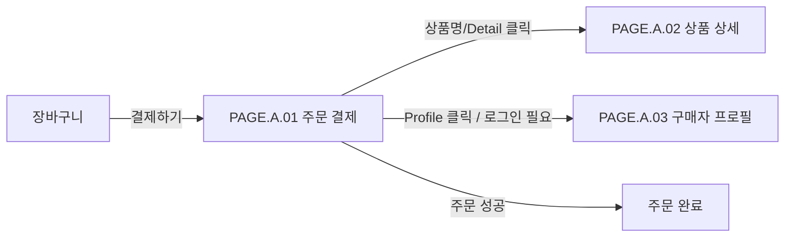

# 주문 결제 페이지

## 페이지 소개

구매자가 주문 상품, 할인, 최종 결제 금액을 확인하고 주문을 확정하는 페이지다.

## 스크린샷

## 연관 사이트맵

[PAGE.A.02](./PAGE_A_02_product_detail.md) [PAGE.A.03](./PAGE_A_03_buyer_profile.md)

## 연관 태그

🏷️ 요구사항 참조: [REQ.A.01](../../00-requirements/.examples/REQ_A_01_order_checkout.md) | 플로우 참조: FLOW.A.01 | UI 참조: [UI.A.01](../../20-ui/.examples/UI_A_01_order_checkout_wireframe.md) | UC 참조: [UC.A.01](../../30-uc/.examples/UC_A_01_place_order.md) | 영속성 참조: [PST.A.01](../../50-service-design/.examples/order/A_01_20-persistence/PST_A_01_order_persistence.md) | 서비스 참조: [SVC.A.01](../../50-service-design/.examples/order/A_01_30-service/SVC_A_01_order_service.md) | 시나리오 참조: [SCN.A.01](../../80-sequence/.examples/SCN_A_01_place_order.md) | API 참조: [API.A.01](../../50-service-design/.examples/order/A_01_40-api/API_A_01_place_order.md)
