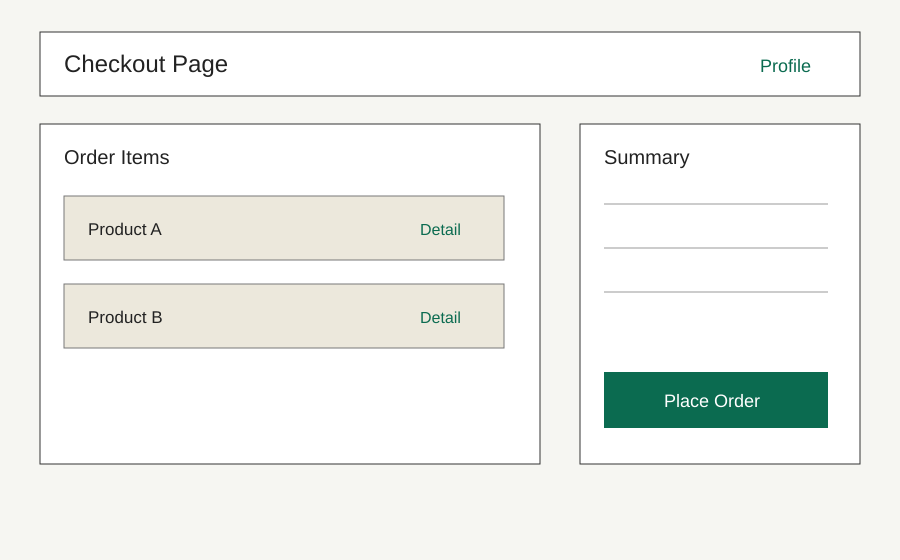

# 구매자 프로필 페이지

## 페이지 소개

구매자가 본인 정보, 기본 배송지, 주문 관련 설정을 확인하거나 수정하는 페이지다.

## 스크린샷

## 연관 사이트맵

[PAGE.A.01](./PAGE_A_01_order_checkout.md)

## 연관 태그

🏷️ 요구사항 참조: [REQ.A.01](../../00-requirements/.examples/REQ_A_01_order_checkout.md) | 이동 출발 페이지: [PAGE.A.01](./PAGE_A_01_order_checkout.md)
