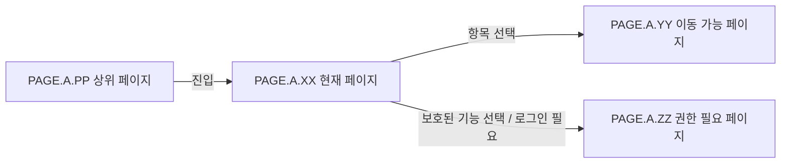

# 페이지 이름

## 페이지 소개

이 페이지가 사용자에게 어떤 화면이고, 어떤 판단이나 행동을 위해 존재하는지 한두 문장으로 설명한다.

## 스크린샷

## 연관 사이트맵

[PAGE.A.PP](./PAGE_A_PP_parent.md) [PAGE.A.YY](./PAGE_A_YY_related_detail.md) [PAGE.A.ZZ](./PAGE_A_ZZ_related_profile.md)

## 연관 태그

🏷️ 요구사항 참조: [REQ.A.XX](../00-requirements/REQ_A_XX_name.md) | 플로우 참조: FLOW.A.XX | UI 참조: [UI.A.XX](../20-ui/UI_A_XX_name.md) | UC 참조: [UC.A.XX](../30-uc/UC_A_XX_name.md) | 영속성 참조: [SD.A.XX20](../50-service-design/A_XX_name/A_XX_20-persistence/README.md) | 서비스 참조: [SD.A.XX30](../50-service-design/A_XX_name/A_XX_30-service/README.md) | 시나리오 참조: [SCN.A.XX](../80-sequence/SCN_A_XX_name.md) | API·CLI 참조: [SD.A.XX40](../50-service-design/A_XX_name/A_XX_40-api/README.md)
