# MongoDB Storage Migration Schema Inventory

작성일: 2026-06-28

## 목적

`mwosa` storage 를 MongoDB 문서 기반 구조로 전환하기 전에, 현재 코드베이스에
존재하는 테이블 기반 스키마와 위치를 도메인별로 고정한다.

이번 문서는 전환 설계의 1차 기준표다. 여기서는 새 MongoDB collection 구조를
확정하지 않고, 기존 SQL/Bun row model 이 어디에 있고 어떤 repository 가 사용하는지
먼저 정리한다.

## TDD 검증 원칙

MongoDB 전환은 구현보다 테스트 정의를 먼저 둔다. 각 테이블 전환은 legacy data
migration 성공 여부가 아니라, 기존 테이블이 맡던 역할을 새 document model 이
만족하는지로 판단한다.

전환 작업은 아래 순서로 진행한다.

1. 실패하는 unit/contract/integration test 를 먼저 추가한다.
2. MongoDB document mapper, repository, index/validator 초기화를 구현한다.
3. 같은 test 를 통과시킨 뒤 해당 테이블 또는 테이블 묶음을 완료로 본다.
4. 필요한 데이터는 기존 SQLite 에서 이관하지 않고 provider 로부터 다시 수집한다.

완료 기준은 coverage 숫자만으로 판단하지 않는다. coverage 는 누락 탐지 보조 지표로
쓰고, 실제 완료 판단은 contract test 와 testcontainers 기반 MongoDB integration
test 통과를 우선한다.

| 테스트 계층 | 실행 방식 | 목적 | 완료 기준 |
| --- | --- | --- | --- |
| unit test | `go test ./...` | stable `_id`, ISO8601 UTC 직렬화, `schema_version`, `revision`, mapper 동작 검증 | MongoDB mapper/helper 는 핵심 branch 를 포함해 80% 이상 coverage 를 목표로 한다. |
| repository contract test | `go test ./...` 또는 backend matrix | service layer repository interface 가 backend 차이를 몰라도 같은 동작을 보장하는지 검증 | SQLite baseline 과 MongoDB 구현이 같은 contract 를 통과한다. |
| MongoDB integration test | `go test -tags=integration ./...` | 실제 MongoDB 에서 collection, index, validator, upsert, optimistic concurrency 를 검증 | testcontainers 로 MongoDB container 를 띄워 핵심 collection 별 통합 테스트를 통과한다. |
| CLI smoke/e2e test | `go test -tags=e2e ./...` | `mwosa init storage`, `mwosa doctor storage`, 작은 sync/get/inspect 흐름 검증 | Docker 또는 testcontainers 환경에서 사용자 경계 명령이 성공한다. |

testcontainers 기반 통합 테스트는 가장 중요한 검증 계층이다. mock 으로는 MongoDB 의
unique index, document validator, BSON Date, update filter, concurrent write conflict
를 충분히 확인할 수 없기 때문이다.

통합 테스트에서 반드시 확인할 항목:

- collection 과 index 가 `mwosa init storage` 기준으로 생성된다.
- 공통 필드 `_id`, `schema_version`, `revision`, `created_at`, `updated_at` 이 모든
  canonical document 에 들어간다.
- 시간 값은 MongoDB 저장 후 CLI/JSON 출력에서 ISO8601 UTC 로 나온다.
- 같은 provider payload 를 두 번 수집해도 중복 document 가 생기지 않는다.
- embed 로 바뀐 테이블은 부모 document 안에 의도한 field/array 로 저장된다.
- 별도 collection 으로 남긴 시계열/대량 데이터는 natural key unique index 로
  idempotent upsert 된다.
- `revision` 조건부 update 에서 동시 수정 conflict 가 명시적인 error 로 드러난다.

## 범위

- 포함: canonical storage 의 Bun row model, `storage.Database.setupSchema` 에서 생성하는 테이블, 별도 provider auth token cache 테이블
- 포함: 테이블에 JSON 문자열로 저장되는 주요 document/payload 필드의 위치
- 제외: provider API 응답 DTO, CLI 출력 DTO, 테스트 전용 fake 구조체

현재 row model 에서는 `PRAGMA foreign_keys = ON` 을 켜지만, Bun tag 로 실제
`FOREIGN KEY` constraint 를 선언한 테이블은 확인되지 않는다. 대부분의 관계는
`*_id` 컬럼과 unique index 로 관리되는 논리적 외래키다. MongoDB 전환에서는 이
논리적 관계를 document embed, natural key reference, 별도 collection 으로 다시
나눈다.

기존 SQLite 데이터를 MongoDB 로 이관하는 legacy migration 계획은 두지 않는다.
아직 개발 중인 저장소이므로 MongoDB 구조는 새 기준으로 설계하고, 필요한 데이터는
provider 로부터 다시 수집한다. 따라서 아래 변경 계획의 초점은 데이터 보존 절차가
아니라 새 document shape 와 collection 경계다.

## MongoDB 공통 문서 필드

모든 canonical collection document 는 아래 공통 필드를 최상위에 둔다. domain
payload 는 이 공통 필드 아래에서 collection 별 field 로 확장한다.

시간 필드는 CLI/JSON 출력에서 ISO8601 UTC 문자열로 표현한다. 표준 형태는
`YYYY-MM-DDTHH:mm:ss.SSSZ` 이다. MongoDB 내부 저장은 BSON Date 를 우선하고,
JSON/NDJSON/export surface 에서는 같은 값을 ISO8601 UTC 문자열로 직렬화한다.

| 필드 | 타입 | 필수 | 의미 |
| --- | --- | --- | --- |
| `_id` | string 또는 ObjectId | 필수 | MongoDB primary key. 재수집/동기화 idempotency 가 중요한 collection 은 stable string key 를 우선한다. |
| `schema_version` | string | 필수 | document shape 버전. 예: `1.0.0`. collection 별 schema 를 독립적으로 올릴 수 있다. |
| `revision` | int64 | 필수 | optimistic concurrency 버전. update 할 때 현재 revision 을 조건에 넣고 성공 시 `+1` 한다. |
| `created_at` | ISO8601 UTC datetime | 필수 | mwosa storage 에 처음 생성된 시각. |
| `updated_at` | ISO8601 UTC datetime | 필수 | mwosa storage 에서 마지막으로 갱신된 시각. |
| `collected_at` | ISO8601 UTC datetime | 선택 | provider/API 에서 데이터를 수집한 시각. 재계산 산출물처럼 수집 개념이 없으면 생략한다. |
| `source_updated_at` | ISO8601 UTC datetime | 선택 | provider 가 제공한 원천 갱신 시각. 원천에 해당 값이 없으면 생략한다. |
| `deleted_at` | ISO8601 UTC datetime | 선택 | soft delete 가 필요한 collection 에만 사용한다. 일반 canonical 데이터에는 기본적으로 두지 않는다. |

공통 필드 모델은 아래처럼 본다.

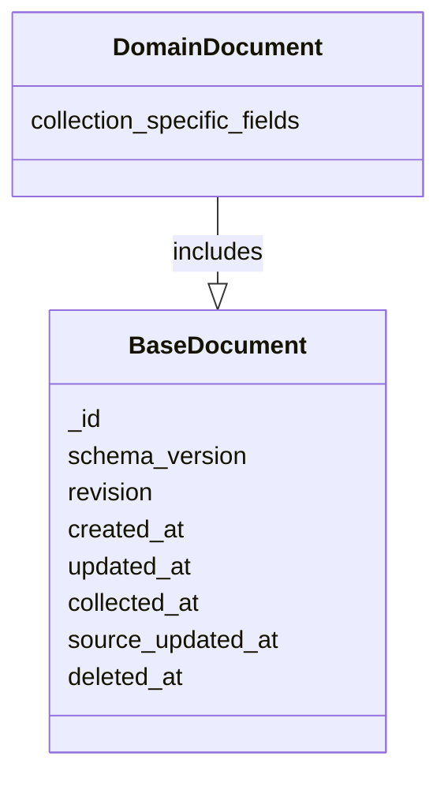

공통 필드 사용 기준:

- `_id` 는 무조건 ObjectId 로 고정하지 않는다. provider 재수집 결과가 같은 문서로
  upsert 되어야 하는 경우 `market:symbol:date:source` 같은 stable key 를 쓴다.
- `schema_version` 은 하위 payload 안에 숨기지 않고 항상 최상위에 둔다.
- `revision` 은 동시 수정 가능성이 있는 document 에서 update filter 로 사용한다.
  append-only 성격의 수집 데이터도 공통 규칙상 필드는 유지한다.
- `created_at`, `updated_at`, `collected_at`, `source_updated_at`, `deleted_at` 은
  모두 UTC 기준 ISO8601 로 출력한다. local timezone 은 저장하지 않는다.
- provider provenance 는 공통 필드가 아니라 domain field 다. 예를 들어 `source`,
  `provider_profile`, `provenance` 같은 이름으로 각 collection 에서 정의한다.

## MongoDB Runtime 관리

`mwosa` 의 기본 canonical storage backend 는 MongoDB 로 둔다. 사용자는
MongoDB server 또는 Atlas cluster 를 먼저 준비하고, `mwosa` 는 준비된 URI 로
접속해 collection validator/index 를 초기화하고 진단한다. SQLite 는 기존
repository 비교 baseline 과 명시적인 `--database` 경로 기반 테스트에만 남긴다.

MongoDB client 생성과 종료는 repository 에서 직접 하지 않는다. `*mongo.Client` 는
connection pool 과 background resource 를 들고 있으므로, 별도 runtime 패키지에서
일괄 관리한다.

초기 패키지 경계는 아래처럼 둔다.

```text
storage/mongodb/
- config.go      // URI, database name, timeout, app name
- runtime.go     // client/database handle, ping, close lifecycle
- indexes.go     // collection validator/index initialization
- document.go    // common document field helper, ISO8601 serialization
- testkit/       // testcontainers 기반 integration test helper
```

runtime 의 책임:

- `NewRuntime(ctx, Config) (*Runtime, error)` 에서 MongoDB client 를 만들고 `Ping` 한다.
- `Runtime.Client() *mongo.Client` 와 `Runtime.Database() *mongo.Database` 를 제공한다.
- `Runtime.Close(ctx) error` 에서 `client.Disconnect(ctx)` 를 호출한다.
- `mwosa init storage` 는 같은 runtime 으로 collection validator/index 를 생성한다.
- `mwosa doctor storage` 는 같은 runtime 으로 ping, server info, collection/validator/index 상태를 확인한다.
- repository 는 `*mongo.Database` 또는 더 작은 collection interface 만 받고, URI/config/shutdown 을 알지 않는다.

CLI/app 조립부에서는 command 종료 시점에 한 번만 graceful shutdown 을 수행한다.
shutdown context 는 request context 와 분리하고 짧은 timeout 을 둔다.

```go
runtime, err := mongodb.NewRuntime(ctx, config)
if err != nil {
	return err
}
defer func() {
	shutdownCtx, cancel := context.WithTimeout(context.Background(), 10*time.Second)
	defer cancel()
	err = oops.Join(err, runtime.Close(shutdownCtx))
}()
```

runtime 설계 기준:

- client lifecycle 은 `storage/mongodb` 가 소유한다.
- repository 는 query/update logic 만 소유한다.
- init/doctor/testcontainers 통합 테스트는 runtime 을 재사용한다.
- close 실패는 조용히 무시하지 않고 command error 에 `oops.Join` 으로 합친다.
- provider auth token cache 는 canonical MongoDB runtime 과 분리하는 것이 기본이다.

## 현재 스키마 진입점

| 구분 | 위치 | 역할 |
| --- | --- | --- |
| canonical storage runtime | `storage/database.go:281` | `setupSchema` 에서 canonical storage 테이블과 인덱스를 생성한다. |
| canonical table list | `storage/database.go:283` | 42개 canonical 테이블과 Bun row model 을 연결한다. |
| canonical index list | `storage/database.go:341` | 현재 SQL natural key, 조회 key, unique constraint 를 정의한다. |
| provider auth runtime | `storage/providerauth/database.go:99` | 별도 SQLite sidecar 로 provider auth token 테이블과 unique index 를 생성한다. |

## 현재 MongoDB 구현 범위

MongoDB 전환 구현은 repository 단위로 진행하되, SQL table 을 그대로 1:1 복제하지
않는다. `migration_runs` 와 `provider_auth_tokens` 는 canonical MongoDB storage
collection 에 포함하지 않는다.

현재 코드 기준 MongoDB repository 구현 범위는 아래와 같다.

| 구분 | MongoDB 구현 | collection/document 기준 |
| --- | --- | --- |
| market data | `storage/dailybar`, `storage/indexbar`, `storage/composition`, `storage/instrument` | `markets`, `instruments`, `daily_bars`, `indexes`, `index_bars`, `compositions` |
| provider raw | `storage/providerraw` | `provider_raw_snapshots` |
| macro | `storage/macro` | `macro_indicators`, `macro_observations` |
| strategy/screening | `storage/strategy`, `storage/strategyfundamentals` | `screen_strategies`, `screen_runs`, `screen_run_items` 와 screening 입력 reader |
| backtest | `storage/backtest` | `backtest_strategies`, `backtest_runs`, `backtest_experiments`, `backtest_experiment_cases` |
| company identity | `storage/companyidentity`, `storage/opendartcompany` | `companies` 문서의 `identifiers[]`, `instruments[]` |
| financials/valuation | `storage/financialstatement`, `storage/financialmetric`, `storage/valuation`, `storage/companyfact`, `storage/companyevent` | `financial_statements`, `financial_metrics`, `valuation_snapshots`, `company_facts`, `company_events` |
| stock summary | `storage/stocksummary` | 위 MongoDB repository 들을 조립하는 reader |

의도적으로 MongoDB repository 를 만들지 않는 범위:

- `storage/migration`: 기존 SQL storage 내부 migration/repair 실행 이력은 이관하지
  않는다. MongoDB 에서는 `storage_metadata` 같은 새 초기화/상태 metadata 만 둔다.
- `storage/providerauth`: provider auth token cache 는 canonical MongoDB runtime 과
  기본적으로 분리한다. MongoDB 로 옮기려면 별도 보안/TTL/마스킹 정책을 먼저
  정의해야 한다.

이 범위는 `storage/mongodb/repository_coverage_test.go` 와
`storage/mongodb/indexes_test.go` 에서 가드한다. `mwosa init storage`,
`mwosa doctor storage` 의 MongoDB runtime/collection/validator 초기화는
`cli/storage_integration_test.go` 에서 testcontainers 기반으로 검증한다.

## 도메인별 테이블 스키마

아래 Mermaid 모델에서 `*--` 는 document embed, `-->` 는 MongoDB 외래키가 아닌
stable key/reference 관계를 뜻한다.

### Market Data

| 도메인 | 현재 테이블 | Row model | 위치 | Repository | 비고 | 변경 계획 |
| --- | --- | --- | --- | --- | --- | --- |
| 일봉 v1 | `daily_bar` | `DailyBarV1Row` | `storage/dailybar_row.go:12` | `storage/dailybar` | 레거시 일봉 테이블. `extensions_json` 포함. | MongoDB 전환 대상에서 제외한다. 새 구조는 v2 기준 `daily_bars` 로 설계하고, 필요한 일봉 데이터는 다시 수집한다. |
| 시장 | `market_v2` | `MarketV2Row` | `storage/dailybar_row.go:42` | `storage/instrument`, `storage/dailybar` | 시장 코드와 장 시간 메타데이터. | 작은 reference 성격이라 `markets` collection 으로 유지하거나 instrument/bar 문서에 market code/timezone snapshot 을 denormalize 한다. |
| provider source | `provider_source_v2` | `ProviderSourceV2Row` | `storage/dailybar_row.go:54` | `storage/dailybar`, `storage/indexbar`, `storage/composition` | provider/provider_group/operation 단위 원천 정의. | SQL 정규화 테이블 역할은 줄이고 각 document 에 `source` object 로 embed 한다. 감사/목록용 registry collection 은 선택사항으로 둔다. |
| 일봉 v2 | `daily_bar_v2` | `DailyBarV2Row` | `storage/dailybar_row.go:65` | `storage/dailybar` | `instrument_id`, `source_id`, `trading_date` 복합 PK. 가격/거래량은 정수 scale 로 저장. | `daily_bars` collection 의 주 문서가 된다. `instrument_id/source_id` FK 대신 `instrument_key`, `source`, `trading_date` unique index 로 관리한다. |
| 일봉 확장 | `daily_bar_extension_v2` | `DailyBarExtensionV2Row` | `storage/dailybar_row.go:92` | `storage/dailybar` | 일봉별 key/value 확장 필드. | 별도 collection 으로 유지하지 않고 `daily_bars.extensions` object 로 embed 한다. |

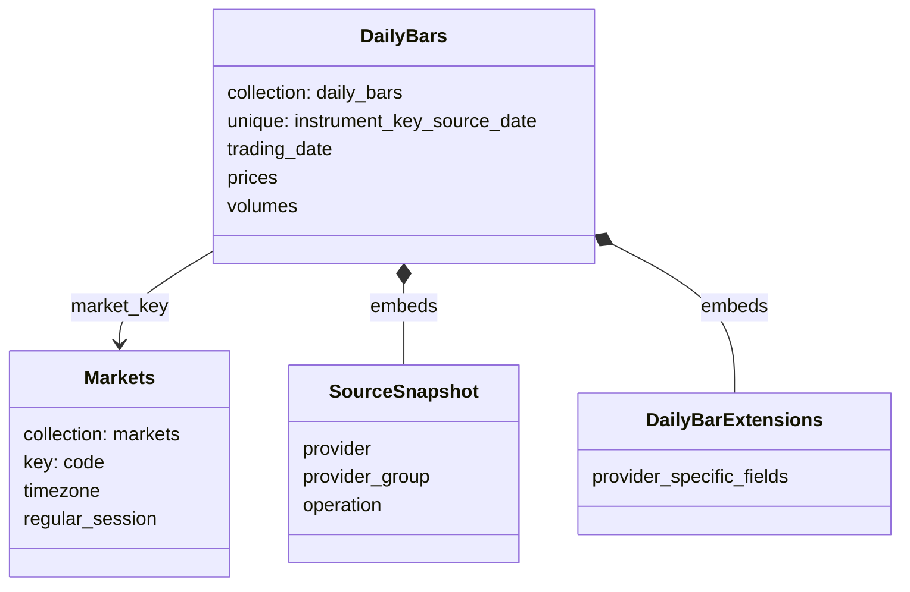

### Instrument

| 도메인 | 현재 테이블 | Row model | 위치 | Repository | 비고 | 변경 계획 |
| --- | --- | --- | --- | --- | --- | --- |
| 종목 | `instrument_v2` | `InstrumentV2Row` | `storage/instrument_row.go:5` | `storage/instrument` | market/security_type/symbol 중심 canonical instrument. | `instruments` collection 의 주 문서가 된다. `market_id` 논리 FK는 market code snapshot 또는 `market_key` 로 대체한다. |
| 종목 원천 매핑 | `instrument_source_v1` | `InstrumentSourceV1Row` | `storage/instrument_row.go:20` | `storage/instrument` | provider symbol 에서 canonical instrument 로 이어지는 매핑. | `instruments.sources[]` 로 embed 한다. provider symbol 역조회는 multikey unique/normal index 로 보강한다. |
| 종목 확장 | `instrument_extension_v1` | `InstrumentExtensionV1Row` | `storage/instrument_row.go:33` | `storage/instrument` | instrument 별 key/value 확장 필드. | `instruments.extensions` object 로 embed 한다. |

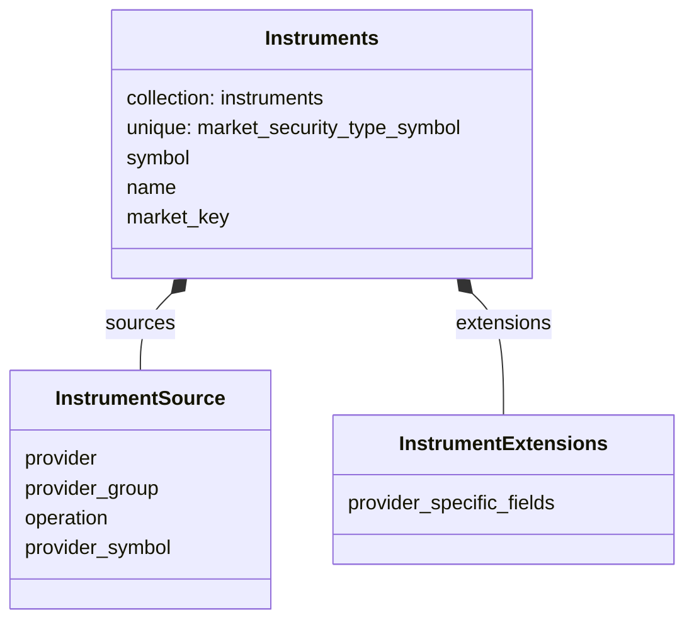

### Composition

| 도메인 | 현재 테이블 | Row model | 위치 | Repository | 비고 | 변경 계획 |
| --- | --- | --- | --- | --- | --- | --- |
| 구성 관측 | `composition_observation_v1` | `CompositionObservationV1Row` | `storage/composition_row.go:5` | `storage/composition` | ETF/지수 구성 같은 subject instrument 기준 관측 헤더. | `compositions` collection 의 주 문서가 된다. subject/source FK는 natural key snapshot 으로 둔다. |
| 구성 종목 | `composition_member_v1` | `CompositionMemberV1Row` | `storage/composition_row.go:17` | `storage/composition` | 구성 관측의 member instrument, 순서, 비중 값. | `compositions.members[]` 로 embed 한다. member instrument 는 id FK 대신 instrument key/reference snapshot 을 저장한다. |

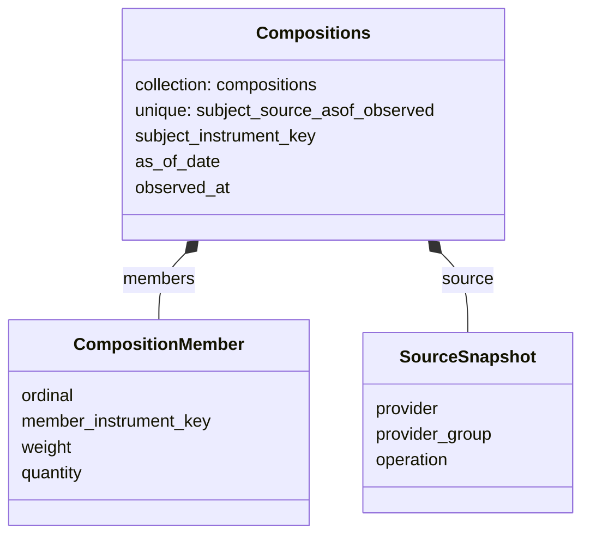

### Index

| 도메인 | 현재 테이블 | Row model | 위치 | Repository | 비고 | 변경 계획 |
| --- | --- | --- | --- | --- | --- | --- |
| 지수 | `index_v1` | `IndexV1Row` | `storage/indexbar_row.go:11` | `storage/indexbar` | market/index_code 기준 canonical index. | `indexes` collection 의 주 문서가 된다. extensions 는 본문에 embed 한다. |
| 지수 원천 매핑 | `index_source_v1` | `IndexSourceV1Row` | `storage/indexbar_row.go:28` | `storage/indexbar` | provider symbol 에서 index 로 이어지는 매핑. | `indexes.sources[]` 로 embed 한다. provider symbol 역조회 인덱스만 별도로 둔다. |
| 지수 일봉 | `index_bar_v1` | `IndexBarV1Row` | `storage/indexbar_row.go:41` | `storage/indexbar` | index_id/source_id/trading_date 기준 지수 OHLCV. | `index_bars` collection 으로 분리한다. index/source FK는 `index_key`, `source`, `trading_date` unique index 로 대체한다. |
| 지수 일봉 확장 | `index_bar_extension_v1` | `IndexBarExtensionV1Row` | `storage/indexbar_row.go:63` | `storage/indexbar` | 지수 일봉별 key/value 확장 필드. | `index_bars.extensions` object 로 embed 한다. |

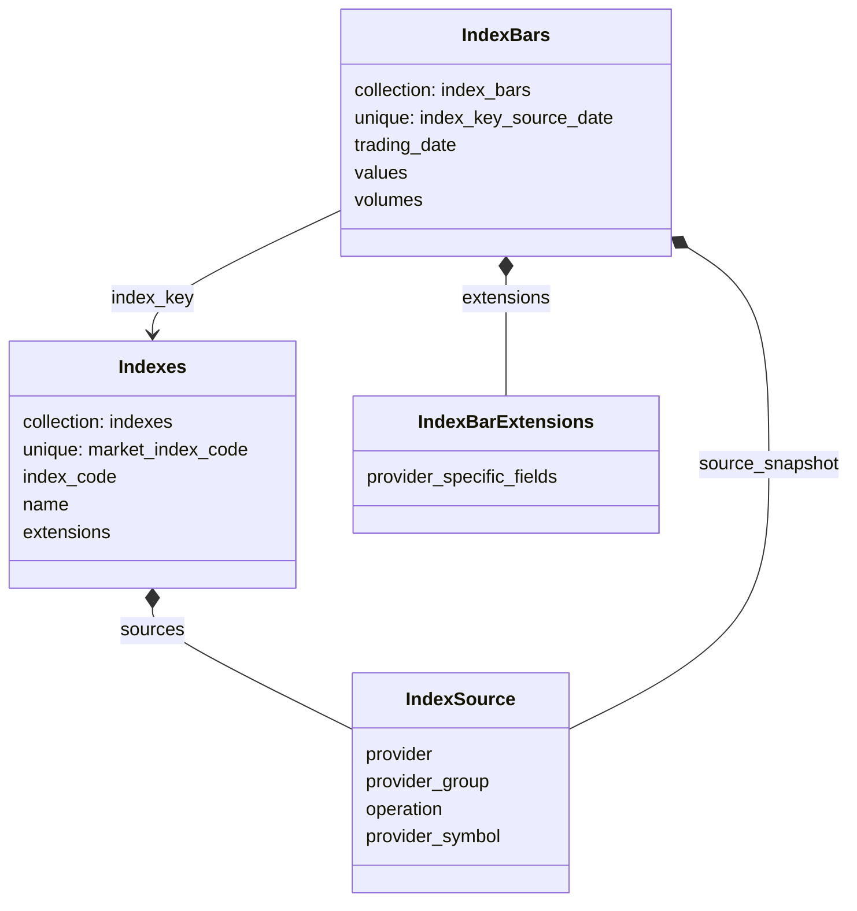

### Macro

| 도메인 | 현재 테이블 | Row model | 위치 | Repository | 비고 | 변경 계획 |
| --- | --- | --- | --- | --- | --- | --- |
| 거시 지표 | `macro_indicator` | `MacroIndicatorRow` | `storage/macro_row.go:7` | `storage/macro` | provider/source_code/category/frequency 메타데이터. | `macro_indicators` collection 의 주 문서가 된다. source/doc 정보를 embed 해 지표 메타 조회를 한 번에 끝낸다. |
| 거시 관측값 | `macro_observation` | `MacroObservationRow` | `storage/macro_row.go:25` | `storage/macro` | indicator_id/period 기준 값. | 시계열성 데이터라 `macro_observations` collection 으로 분리한다. `indicator_id`는 MongoDB FK가 아니라 stable key reference 로 둔다. |
| 거시 지표 원천 | `macro_indicator_source` | `MacroIndicatorSourceRow` | `storage/macro_row.go:38` | `storage/macro` | provider source provenance. | `macro_indicators.sources[]` 로 embed 한다. |
| 거시 provider 문서 | `macro_indicator_provider_doc` | `MacroIndicatorProviderDocRow` | `storage/macro_row.go:50` | `storage/macro` | `document_json` 과 `schema_version` 을 저장한다. | `macro_indicators.provider_docs[]` 또는 `provider_doc` object 로 embed 한다. schema_version 은 문서 내부 metadata 로 유지한다. |

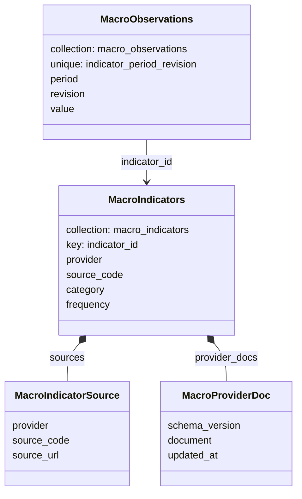

### Strategy And Screening

| 도메인 | 현재 테이블 | Row model | 위치 | Repository | 비고 | 변경 계획 |
| --- | --- | --- | --- | --- | --- | --- |
| 스크리닝 전략 | `strategies` | `StrategyRow` | `storage/strategy_row.go:9` | `storage/strategy` | 전략 식별자, 이름, archive 상태. | `screen_strategies` collection 의 주 문서가 된다. active_version 은 id FK 대신 embedded version id 또는 version number 로 관리한다. |
| 스크리닝 전략 버전 | `strategy_versions` | `StrategyVersionRow` | `storage/strategy_row.go:21` | `storage/strategy` | `params_json`, `spec_json`, query/spec hash 포함. | 버전 수가 작으면 `screen_strategies.versions[]` 로 embed 한다. 버전이 커질 가능성이 생기면 `screen_strategy_versions` 분리를 허용한다. |
| 스크리닝 실행 | `screen_runs` | `ScreenRunRow` | `storage/strategy_row.go:38` | `storage/strategy` | 실행 alias, dataset, summary JSON. | `screen_runs` collection 으로 분리한다. strategy/version 은 snapshot 과 reference key 를 함께 저장해 과거 실행 재현성을 지킨다. |
| 스크리닝 실행 항목 | `screen_run_items` | `ScreenRunItemRow` | `storage/strategy_row.go:62` | `storage/strategy` | 결과 row 의 `payload_json` 저장. | 결과 row 수가 커질 수 있으므로 기본은 `screen_run_items` 별도 collection 유지. 작은 결과 preview 만 `screen_runs.preview_items[]` 로 embed 가능. |

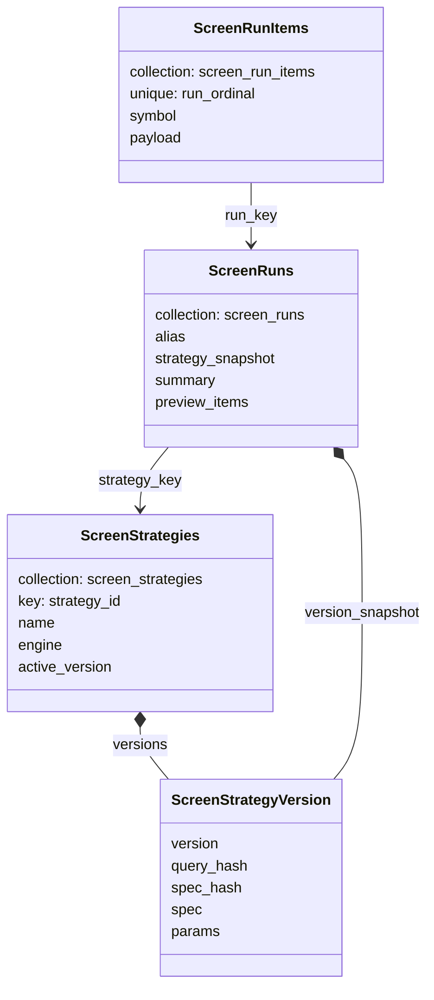

### Backtest

| 도메인 | 현재 테이블 | Row model | 위치 | Repository | 비고 | 변경 계획 |
| --- | --- | --- | --- | --- | --- | --- |
| 백테스트 전략 | `backtest_strategies` | `BacktestStrategyRow` | `storage/backtest_strategy_row.go:9` | `storage/backtest` | 백테스트 전략 식별자와 soft delete. | `backtest_strategies` collection 의 주 문서가 된다. active_version 은 embedded version key 로 관리한다. |
| 백테스트 전략 버전 | `backtest_strategy_versions` | `BacktestStrategyVersionRow` | `storage/backtest_strategy_row.go:20` | `storage/backtest` | 전략 spec JSON 과 hash. | `backtest_strategies.versions[]` 로 embed 한다. spec/hash 는 document 본문으로 저장한다. |
| 백테스트 실행 | `backtest_runs` | `BacktestRunRow` | `storage/backtest_run_row.go:9` | `storage/backtest` | run key 필드, result/metrics JSON, result hash. | `backtest_runs` collection 으로 유지한다. result/metrics 는 BSON document 로 저장하고 strategy/run hash 로 unique index 를 둔다. |
| 백테스트 평가 실험 | `backtest_experiments` | `BacktestExperimentRow` | `storage/backtest_evaluation_row.go:9` | `storage/backtest` | evaluation spec JSON, schema version, spec hash. | `backtest_experiments` collection 의 주 문서가 된다. spec 은 본문 document 로 저장하고 base_run 은 stable run key reference 로 둔다. |
| 백테스트 평가 case | `backtest_experiment_cases` | `BacktestExperimentCaseRow` | `storage/backtest_evaluation_row.go:25` | `storage/backtest` | parameter JSON, regime tags JSON, rank. | case 수가 커질 수 있으므로 `backtest_experiment_cases` 별도 collection 유지. experiment_id FK는 experiment key reference 로 대체한다. |
| 백테스트 평가 결과 | `backtest_results` | `BacktestResultRow` | `storage/backtest_evaluation_row.go:52` | `storage/backtest` | case 별 result JSON. | case 와 1:1이면 `backtest_experiment_cases.result` 로 embed 한다. 결과 문서가 과도하게 크면 별도 `backtest_results` 로 유지한다. |
| 백테스트 metric 요약 | `backtest_metric_summaries` | `BacktestMetricSummaryRow` | `storage/backtest_evaluation_row.go:65` | `storage/backtest` | case/metric/value 요약. | case document 의 `metrics[]` 로 embed 한다. metric 검색이 중요하면 `experiment_id + metric` index 를 case collection 에 둔다. |
| 백테스트 walk-forward step | `backtest_walk_forward_steps` | `BacktestWalkForwardStepRow` | `storage/backtest_evaluation_row.go:75` | `storage/backtest` | step 별 train/test 기간, selected parameter JSON, test metrics JSON. | `backtest_experiments.walk_forward.steps[]` 로 embed 한다. step 수가 커지면 별도 collection 분리를 허용한다. |

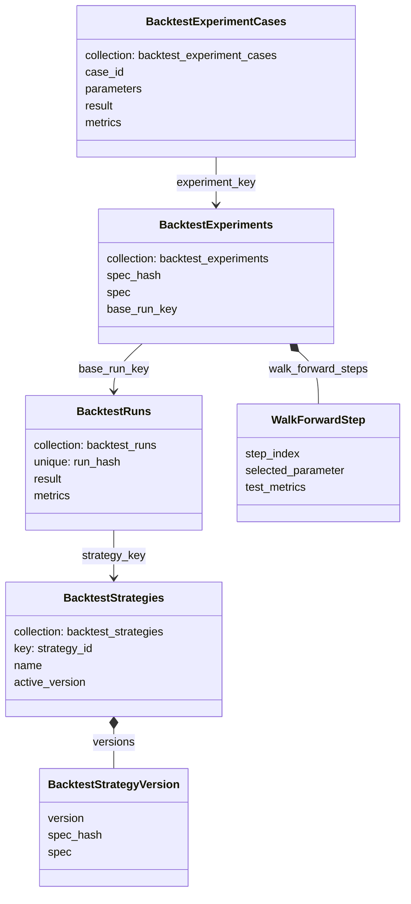

### Provider Raw Data

| 도메인 | 현재 테이블 | Row model | 위치 | Repository | 비고 | 변경 계획 |
| --- | --- | --- | --- | --- | --- | --- |
| provider raw snapshot | `provider_raw_snapshots` | `ProviderRawSnapshotRow` | `storage/provider_raw_snapshot_row.go:5` | `storage/providerraw` | provider operation/base_date 별 raw `payload_json`. | `provider_raw_snapshots` collection 으로 유지한다. raw payload 는 BSON document/array 로 저장하고 provider+operation+base_date unique index 를 둔다. |

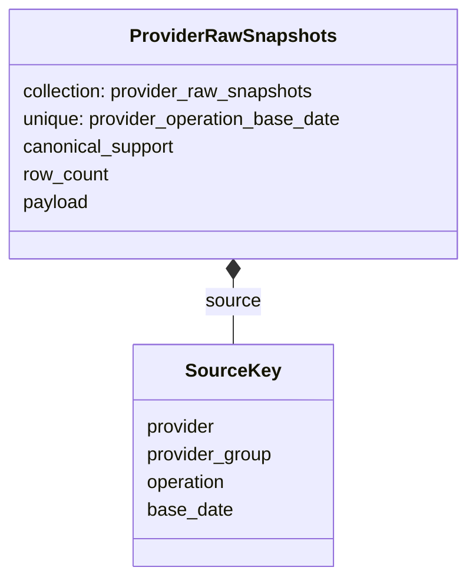

### OpenDART And Company Identity

| 도메인 | 현재 테이블 | Row model | 위치 | Repository | 비고 | 변경 계획 |
| --- | --- | --- | --- | --- | --- | --- |
| OpenDART 회사 | `opendart_companies` | `OpenDARTCompanyRow` | `storage/opendart_company_row.go:5` | `storage/opendartcompany` | OpenDART corp_code/stock_code/corp_name 매핑. | `companies.identifiers[]` 또는 `companies.provider_profiles.opendart` 로 흡수한다. 별도 OpenDART table 정규화는 제거한다. |
| 회사 | `company_v1` | `CompanyV1Row` | `storage/company_identity_row.go:5` | `storage/companyidentity` | canonical company. | `companies` collection 의 주 문서가 된다. name/legal_name/country 를 본문에 둔다. |
| 회사 식별자 | `company_identifier_v1` | `CompanyIdentifierV1Row` | `storage/company_identity_row.go:17` | `storage/companyidentity` | provider identifier, valid period, confidence. | `companies.identifiers[]` 로 embed 한다. identifier 역조회는 multikey index 로 처리한다. |
| 종목-회사 링크 | `instrument_company_link_v1` | `InstrumentCompanyLinkV1Row` | `storage/company_identity_row.go:36` | `storage/companyidentity` | instrument 와 company 관계. | `companies.instruments[]` 와 필요 시 `instruments.company` snapshot 으로 denormalize 한다. 관계 이력은 valid_from/to 를 배열 요소에 보존한다. |

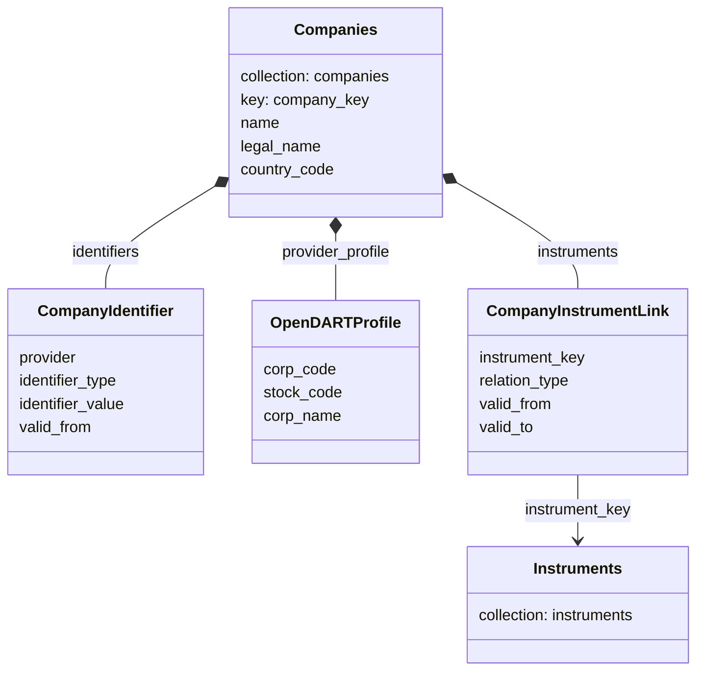

### Financials And Valuation

| 도메인 | 현재 테이블 | Row model | 위치 | Repository | 비고 | 변경 계획 |
| --- | --- | --- | --- | --- | --- | --- |
| 재무제표 헤더 | `financial_statement_v1` | `FinancialStatementV1Row` | `storage/financial_statement_row.go:5` | `storage/financialstatement` | 회사/종목/provider/report/fs_div/statement_type 기준 헤더. | `financial_statements` collection 의 주 문서가 된다. company/instrument 는 key snapshot 으로 저장하고 provider/report natural key 로 unique index 를 둔다. |
| 재무제표 라인 | `financial_line_item_v1` | `FinancialLineItemV1Row` | `storage/financial_statement_row.go:28` | `storage/financialstatement` | statement 하위 account/amount/extension JSON. | `financial_statements.line_items[]` 로 embed 한다. statement_id FK는 제거한다. |
| 재무 metric | `financial_metric_v1` | `FinancialMetricV1Row` | `storage/financial_metric_row.go:5` | `storage/financialmetric` | 계산된 metric, fiscal period, formula version. | `financial_metrics` collection 으로 유지한다. statement_id 는 optional provenance reference 로 낮추고 company/instrument/metric/as_of_date 인덱스를 둔다. |
| valuation snapshot | `valuation_snapshot_v1` | `ValuationSnapshotV1Row` | `storage/valuation_snapshot_row.go:5` | `storage/valuation` | as_of_date 기준 valuation 지표 스냅샷. | `valuation_snapshots` collection 으로 유지한다. metric_source_version/provenance/uncomputable 을 본문 document 로 저장한다. |
| 회사 fact | `company_fact_v1` | `CompanyFactV1Row` | `storage/company_fact_row.go:5` | `storage/companyfact` | provider fact, key/value, raw JSON. | `company_facts` collection 으로 유지한다. company/instrument key snapshot 과 raw document 를 저장하고 fact_type/date 인덱스를 둔다. |
| 회사 event | `company_event_v1` | `CompanyEventV1Row` | `storage/company_event_row.go:5` | `storage/companyevent` | 공시/배당/기타 이벤트, raw JSON. | `company_events` collection 으로 유지한다. 이벤트 조회가 독립적이므로 company document 에 전부 embed 하지 않는다. |

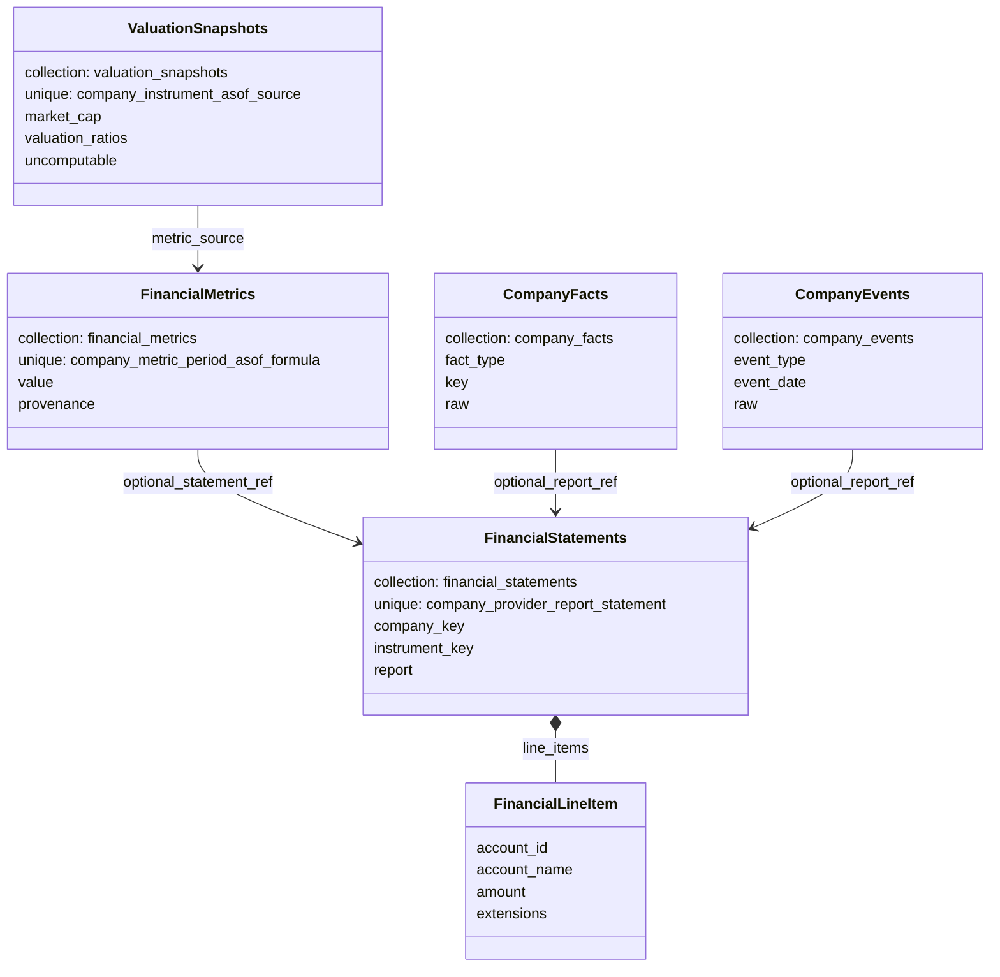

### Migration Metadata

| 도메인 | 현재 테이블 | Row model | 위치 | Repository | 비고 | 변경 계획 |
| --- | --- | --- | --- | --- | --- | --- |
| migration 실행 기록 | `migration_runs` | `MigrationRunRow` | `storage/migration_row.go:5` | `storage/migration` | SQL storage 내부 migration/repair 실행 이력. | 기존 SQL migration/repair 이력은 이관하지 않는다. MongoDB 에서는 필요할 때 새 storage 초기화/버전 확인 metadata 만 별도 collection 으로 둔다. |

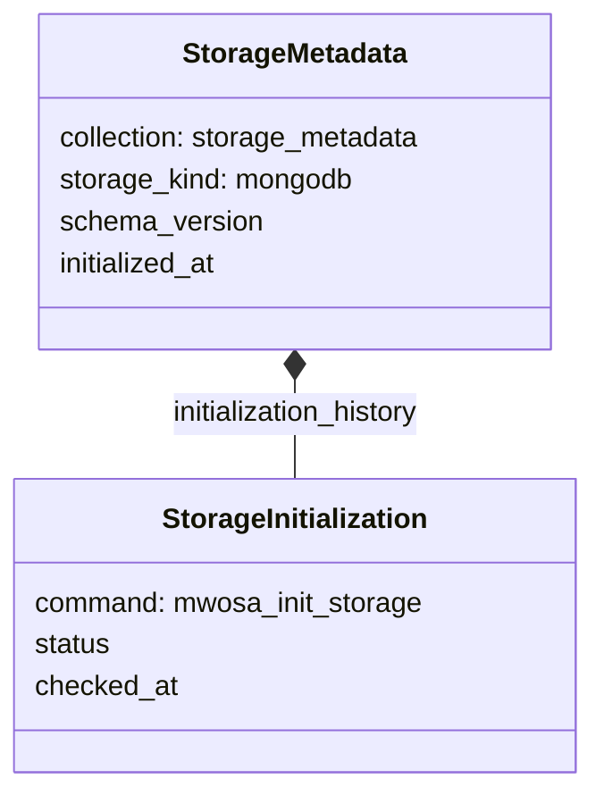

### Provider Auth Sidecar

| 도메인 | 현재 테이블 | Row model | 위치 | Repository | 비고 | 변경 계획 |
| --- | --- | --- | --- | --- | --- | --- |
| provider auth token cache | `provider_auth_tokens` | `TokenRow` | `storage/providerauth/token_row.go:9` | `storage/providerauth` | canonical storage 와 별도 SQLite sidecar. MongoDB 전환 범위에 넣을지 별도 결정 필요. | 보안상 canonical data 와 분리 유지가 기본이다. MongoDB 로 옮긴다면 별도 `provider_auth_tokens` collection, TTL/unique index, secret masking 정책을 먼저 정의한다. |

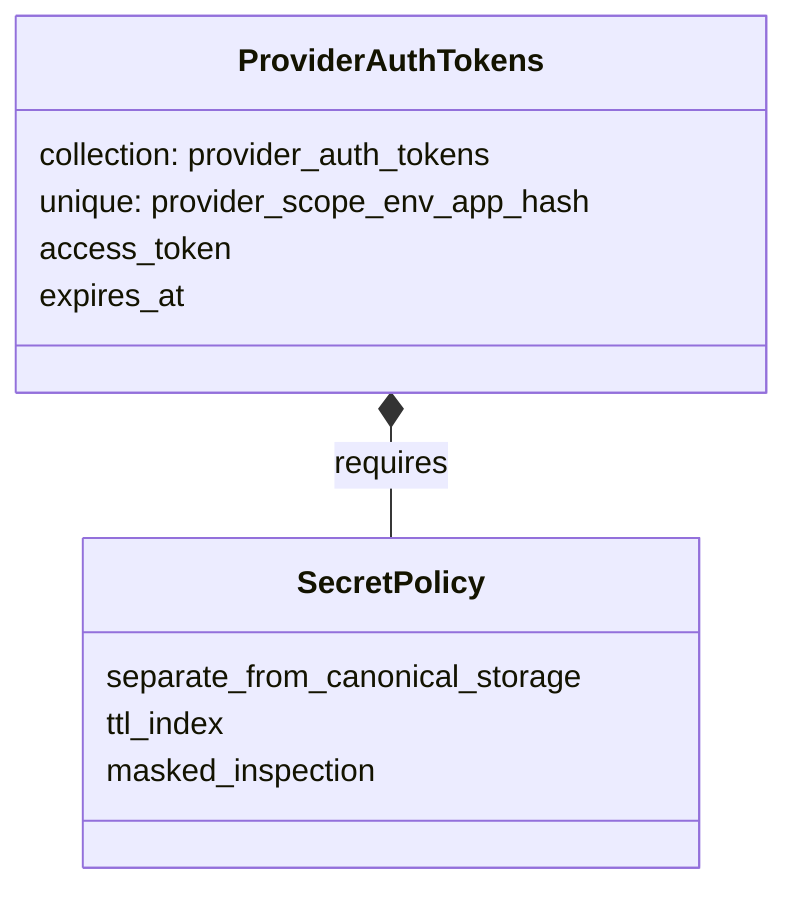

## JSON Document/Payload 필드

MongoDB 전환에서 우선적으로 문서 형태를 살릴 수 있는 필드다.

| 위치 | 현재 필드 | 현재 저장 방식 | 전환 메모 |
| --- | --- | --- | --- |
| `storage/dailybar_row.go:35` | `DailyBarV1Row.ExtensionsJSON` | JSON 문자열 | 일봉 provider 확장 필드. v2 에서는 별도 extension 테이블도 존재한다. |
| `storage/indexbar_row.go:23` | `IndexV1Row.ExtensionsJSON` | JSON 문자열 | 지수 메타데이터의 provider/domain 확장 필드. |
| `storage/financial_statement_row.go:42` | `FinancialLineItemV1Row.ExtensionsJSON` | JSON 문자열 | 재무제표 라인별 provider/account 확장 필드. |
| `storage/financial_metric_row.go:20` | `FinancialMetricV1Row.ProvenanceJSON` | JSON 문자열 | 계산 metric 의 근거와 원천 메타데이터. |
| `storage/valuation_snapshot_row.go:23` | `ValuationSnapshotV1Row.ProvenanceJSON`, `UncomputableJSON` | JSON 문자열 | valuation 계산 근거와 계산 불가 사유 문서. |
| `storage/macro_row.go:56` | `MacroIndicatorProviderDocRow.DocumentJSON` | JSON 문자열 | provider-native indicator 문서. `schema_version` 과 함께 보존. |
| `storage/strategy_row.go:31` | `StrategyVersionRow.ParamsJSON`, `SpecJSON` | JSON 문자열 | 전략 정의 문서. MongoDB 에서는 strategy version document 로 자연스럽게 합칠 수 있다. |
| `storage/strategy_row.go:48` | `ScreenRunRow.ParamsJSON` | JSON 문자열 | 실행 시점 parameter 문서. |
| `storage/strategy_row.go:58` | `ScreenRunRow.SummaryJSON` | JSON 문자열 | 실행 요약 문서. |
| `storage/strategy_row.go:69` | `ScreenRunItemRow.PayloadJSON` | JSON 문자열 | 스크리닝 결과 row. document collection 에 가장 가까운 현재 모델. |
| `storage/backtest_strategy_row.go:27` | `BacktestStrategyVersionRow.SpecJSON` | JSON 문자열 | 백테스트 전략 정의 문서. |
| `storage/backtest_run_row.go:26` | `BacktestRunRow.ResultJSON`, `MetricsJSON` | JSON 문자열 | 실행 결과와 metric 요약 문서. 실행 입력은 주로 strategy/version 쪽 spec 과 run key 필드로 남아 있다. |
| `storage/backtest_evaluation_row.go:17` | `BacktestExperimentRow.SpecJSON` | JSON 문자열 | 평가 실험 정의 문서. |
| `storage/backtest_evaluation_row.go:35` | `BacktestExperimentCaseRow.ParameterJSON`, `RegimeTagsJSON` | JSON 문자열 | 평가 case 조건과 regime tag 문서. |
| `storage/backtest_evaluation_row.go:57` | `BacktestResultRow.ResultJSON` | JSON 문자열 | 평가 case 결과 문서. |
| `storage/backtest_evaluation_row.go:85` | `BacktestWalkForwardStepRow.SelectedParameterJSON`, `TestMetricsJSON` | JSON 문자열 | walk-forward 단계별 선택 parameter 와 test metric 문서. |
| `storage/provider_raw_snapshot_row.go:15` | `ProviderRawSnapshotRow.PayloadJSON` | JSON 문자열 | provider raw snapshot 원문. |
| `storage/company_fact_row.go:25` | `CompanyFactV1Row.RawJSON` | JSON 문자열 | provider fact 원문. |
| `storage/company_event_row.go:21` | `CompanyEventV1Row.RawJSON` | JSON 문자열 | provider event 원문. |

## 관련 비테이블 스키마 표면

이 구조체들은 직접 테이블을 만들지는 않지만, 현재 테이블의 JSON payload 와 강하게
연결된다. MongoDB 전환에서 collection document shape 를 설계할 때 함께 봐야 한다.

| 도메인 | 스키마 위치 | 연결되는 저장소 |
| --- | --- | --- |
| 스크리닝 전략 YAML/JSON | `service/strategy/service.go:166`, `service/strategy/yaml.go:18` | `strategies`, `strategy_versions`, `screen_runs`, `screen_run_items` |
| universe pipeline/spec | `packages/universe/spec.go:5`, `packages/universe/universe.go:24`, `service/universe/service.go:43` | `screen_runs`, `screen_run_items`, `daily_bar_v2` |
| market regime spec/result | `packages/universe/regime.go:20`, `service/universe/regime.go:18` | 현재는 service-level payload 성격. |
| 백테스트 spec/evaluation spec | `packages/backtest/spec.go:5`, `service/backtest/yaml.go:15` | `backtest_strategy_versions`, `backtest_runs`, `backtest_experiments` |
| 백테스트 engine result | `packages/backtest/engine.go:27`, `packages/backtest/evaluation.go:210` | `backtest_runs`, `backtest_results`, `backtest_walk_forward_steps` |

## MongoDB 전환 분석 기준

다음 단계에서는 이 inventory 를 기준으로 각 SQL 테이블을 그대로 collection 으로
옮길지, MongoDB 문서 단위로 합칠지 결정한다.

우선 검토할 결합 후보는 아래와 같다.

| 후보 | 현재 테이블 묶음 | 판단 기준 |
| --- | --- | --- |
| `daily_bars` 계열 | `daily_bar_v2`, `daily_bar_extension_v2`, `provider_source_v2`, 일부 `instrument_v2` 참조 | 조회 단위가 instrument/date 이면 bar document 안에 확장 필드를 넣는 편이 자연스럽다. |
| `instruments` | `instrument_v2`, `instrument_source_v1`, `instrument_extension_v1` | instrument 본문에 source mappings/extensions 를 embed 할 수 있다. |
| `compositions` | `composition_observation_v1`, `composition_member_v1` | observation document 안에 members 배열을 넣을 가능성이 높다. |
| `index_bars` | `index_v1`, `index_source_v1`, `index_bar_v1`, `index_bar_extension_v1` | index 메타와 bar 시계열을 분리할지 결정 필요. |
| `macro_indicators` | `macro_indicator`, `macro_indicator_source`, `macro_indicator_provider_doc` | indicator document 에 source/provider doc 을 포함할 수 있다. |
| `macro_observations` | `macro_observation` | 관측값은 시계열 조회량에 따라 별도 collection 이 유리할 수 있다. |
| `screen_strategies` | `strategies`, `strategy_versions` | strategy document + versions 배열 또는 version 별 document 중 선택. |
| `screen_runs` | `screen_runs`, `screen_run_items` | 결과 item 이 커질 수 있어 run document 와 items collection 분리 여부 검토. |
| `backtest_*` | `backtest_*` 전체 | 실험/실행/결과 JSON 이 이미 문서형이므로 MongoDB 전환 효과가 크다. |
| `companies` | `company_v1`, `company_identifier_v1`, `instrument_company_link_v1`, `opendart_companies` | company 중심 문서로 합칠 수 있으나 instrument 조회 경로를 같이 봐야 한다. |
| `financial_statements` | `financial_statement_v1`, `financial_line_item_v1` | statement document 안에 line_items 배열을 넣는 후보. |
| `financial_metrics` | `financial_metric_v1`, `valuation_snapshot_v1` | 조회 패턴에 따라 metric snapshot 문서로 재구성 가능. |
| `company_facts_events` | `company_fact_v1`, `company_event_v1` | raw JSON 을 살린 event/fact document collection 후보. |

## 확인된 총량

- canonical storage table: 42개
- provider auth sidecar table: 1개
- 주된 row model 위치: `storage/*_row.go`, `storage/providerauth/token_row.go`
- 주된 repository 위치: `storage/<domain>/repository.go`, `storage/dailybar/read_repository.go`, `storage/dailybar/write_repository.go`
